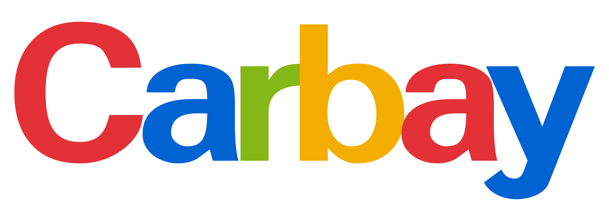

# The Evolution of an Ethereum Car Auction

## Capstone Project Developed By:
    Benny Antony
    Nenita Espinosa
    Steve Adeneye

## Purpose

* Create a smart contract to register a vehicle for sale on an Ethereum blockchain auction

* Tokenize the vehicle title so that it can be transferred to the auction winner as an NFT

* Create a second contract to run the vehicle auction on the Ethereum network

* Create a Dapp for users to interact with the smart contract and bid on the vehicles listed for sale on the auction
   

## Original Solidity Contract

  
## Deployed Contract

  
## Transferred Token

## Issues With Original Contracts

We were able to successfully deploy functioning contracts that met goals 1-3 stated in our "Purpose" section above.  However we ran into issues developing a DApp for users to successfully interact with these contracts.  Given the time constraints of this project, we had to rethink our approach to the contracts in order to ensure that we could deploy a working auction AND successfully create a DApp for it.  This lead to the "Evolution" of our car auction...

## A New Contract Was Developed

Using inspiration from the Truffle Suite Petshop Tutorial, we were able to create and deploy our final contract and a working DApp.  These can be found in the folder "Carbay Final Code" along with instructions for deployment.  

