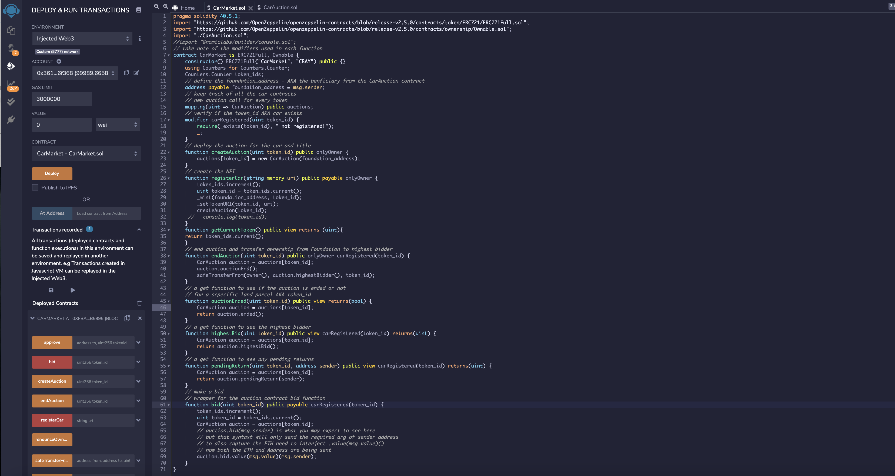

# The Evolution of an Ethereum Car Auction

## Capstone Project Developed By:
    Benny Antony
    Nenita Espinosa
    Steve Adeneye

## Purpose

* Create a smart contract to register a vehicle for sale on an Ethereum blockchain auction

* Tokenize the vehicle title so that it can be transferred to the auction winner as an NFT

* Create a second contract to run the vehicle auction on the Ethereum network

* Create a Dapp for users to interact with the smart contract and bid on the vehicles listed for sale on the auction
   

## Solidity Contract

  
## Deployed Contract

  
## Transferred Token

        

